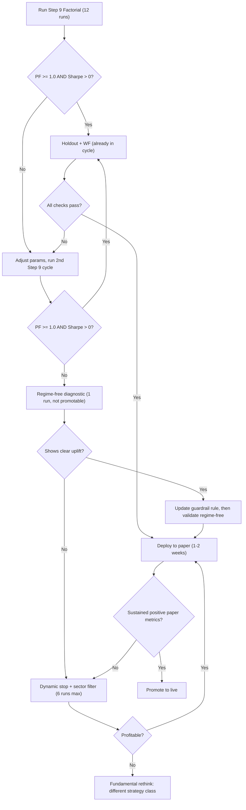

# Strategy Assessment & Fastest Path to Profitability

**Date**: 2026-02-23 | **Baseline**: Sharpe -0.2135, PF 0.871, 53 trades, -2.16% return

---

## 2026-02-25 Update (Current Status)

The Step 9 constrained cycle recommended in this document has now been executed twice under regime-aware parity:

| Cycle | Artifact | Best In-Sample (Sharpe / PF / Trades) | Holdout PF | WF Avg Sharpe | Accepted |
|---|---|---:|---:|---:|---|
| Cycle 1 (default grid) | `reports/backtests/step9_factorial_20260224_071731/summary.json` | `-0.2135 / 0.8711 / 53` | `2.6401` | `-0.1829` | `No` |
| Cycle 2 (dynamic stop + regime-size scaling enabled) | `reports/backtests/step9_factorial_20260224_213624/summary.json` | `-0.5068 / 0.7580 / 64` | `3.1994` | `-0.0183` | `No` |

Implication:
- Trigger condition for bounded rethink is now met (two consecutive Step 9 failures on primary window PF/Sharpe).
- Next action moved from "run Step 9" to "run bounded 6-run rethink track" as documented in `IMPLEMENTATION_PLAN.md`.

The remainder of this document is retained for diagnosis context and rationale.

---

## Diagnosis: Why the Strategy Isn't Profitable Yet

### The Numbers Tell a Clear Story

| Exit Type | Count | Total PnL | Avg PnL | Impact |
|---|---:|---:|---:|---|
| **TRAILING_STOP** | 23 | **+INR 7,460** | +INR 324 | The engine works -- winners run |
| **STOP_LOSS** | 6 | **-INR 6,805** | -INR 1,134 | 6 trades erase all gains |
| BREAKEVEN_STOP | 6 | -INR 855 | -INR 143 | 0% win rate, costs eat the buffer |
| TIME_STOP | 11 | -INR 2,358 | -INR 214 | Weak entries that drift nowhere |
| BACKTEST_END | 7 | +INR 395 | +INR 56 | Neutral (open positions at cutoff) |

**Core insight**: The trailing-stop engine is strong (+INR 7,460 from 23 trades at 74% win rate). The system's *edge is real* -- it just gets destroyed by 6 catastrophic stop-loss trades averaging -INR 1,134 each. Fixing the left tail is the highest-leverage change available.

### Root Cause Chain

```
High-ATR entries -> wide stop distance -> catastrophic loss when stopped out
          |
No per-trade loss cap -> full risk exposure on volatile midcaps
          |
Breakeven buffer too thin -> costs eat the 0.5% buffer -> 0% win rate
          |
Net: trailing-stop winners (+INR 7,460) fully consumed by preventable losses (-INR 9,663)
```

### The Regime Effect

> [!WARNING]
> The regime-OFF row below is from a **pre-parity run** (before `BacktestEngine` wired regime computation per-day). Per the "Runtime Parity" section in `IMPLEMENTATION_PLAN.md`, pre-parity tables are not directly comparable to current regime-aware results. This table is included as directional evidence only.

| Config | Sharpe | PF | Trades | Note |
|---|---:|---:|---:|---|
| Midcap150, regime OFF (pre-parity, Feb 14) | +1.42 | 1.94 | 63 | Not comparable to current parity runs |
| Midcap150, regime ON, binary gate ON | -1.91 | 0.41 | 42 | Current parity run |
| Midcap150, regime ON, binary gate OFF | -0.21 | 0.87 | 53 | Current parity run (active config) |

The directional signal is clear: the binary gate was harmful. Removing it recovered Sharpe from -1.91 to -0.21. The tighten-steps mechanism may still be over-filtering, but the exact magnitude of regime drag vs. pre-parity results cannot be compared directly.

---

## What's Been Tried and Failed

> [!WARNING]
> 100+ experiments have been executed. The failure pattern is consistent and instructive.

| Approach | Experiments | Result |
|---|---:|---|
| Momentum parameter tuning | 50+ | Maxed at 1/4 anchor passes |
| Strategy diversification (bear, vol-reversal, mean-reversion) | 20+ | No improvement over momentum-only |
| Exit-only tuning (Step 8) | 6 variants | All regressed vs baseline |
| Volume ratio changes | 3 | 0.65 harmful, 0.80 optimal |
| RSI band tuning | 3 | 40-72 best, marginal lift only |
| Regime gate modes | 4 | Binary gate harmful, tighten-steps marginal |

**Key lesson**: The action surface for further exit/filter parameter tuning is exhausted. The problem is structural -- entry risk control, not signal quality.

---

## Fastest Path to Profitability

### Phase 1: Fix the Left Tail (Immediate -- 1 day)

This is the single highest-impact change. The PnL arithmetic:

**If STOP_LOSS total PnL improves from -INR 6,805 to -INR 3,400** (halved via ATR cap + max loss cap), total system PnL flips from **-INR 2,163 to approximately +INR 1,242**. Note: positive total PnL is necessary but not sufficient for positive Sharpe -- Sharpe depends on the distribution of daily returns, not just mean PnL. However, removing the largest loss outliers should materially improve both.

Three levers, all already coded but not yet validated in a constrained cycle:

1. **ATR-cap filter** (`max_weekly_atr_pct`):
   - Hypothesis: the 6 STOP_LOSS trades (BSOFT -14.6%, HUDCO -13.1%, SCHAEFFLER -8.6%, etc.) had elevated ATR/price ratios. This is inferred from large STOP_LOSS percentages in trade records and strategy metadata; pending direct confirmation from Step 9 diagnostics (`high_atr_pct` scan stat rejections).
   - Factorial tests values `0.06` and `0.08` (script defaults)
   - **Expected impact**: eliminates 3-4 of the 6 catastrophic trades -> +INR 3,000-4,500 PnL improvement

2. **Max-loss-per-trade cap** (`MAX_LOSS_PER_TRADE`):
   - Even with ATR filtering, position sizing should hard-cap dollar loss
   - Factorial tests values `0.0` (disabled) and `0.008` (INR 800 max loss on 100K capital) per script defaults
   - If a higher cap is needed, pass `--max-loss-per-trade-values 0.0,0.015` to test INR 1,500 cap
   - **Expected impact**: truncates remaining stop losses -> additional INR 500-1,000 improvement

3. **Cost-aware breakeven floor** (already coded):
   - Current breakeven buffer (0.5%) is consumed by 0.355% round-trip costs
   - Adding cost to the floor means breakeven only fires at entry+0.855%
   - **Expected impact**: converts some BREAKEVEN_STOP losses to small wins -> INR 300-500 improvement

> [!IMPORTANT]
> **Action**: Run the already-built `run_step9_factorial.py` constrained cycle (12 runs total). This tests 2x2x2 combinations of ATR cap x max loss x stop mult, plus retest, holdout, and walk-forward. No new code needed.

### Phase 2: Regime Calibration (1-2 days, if Phase 1 succeeds)

The regime tighten-steps mechanism is still costing trades. Two specific calibration options:

**Option A (Conservative)**: Soften tighten thresholds
- Current: tighten when `confidence < 0.55`, `breadth < 0.52`, `vol > 0.50`
- Proposed: tighten when `confidence < 0.45`, `breadth < 0.45`, `vol > 0.60`
- This lets more entries through in "choppy" regimes that still have individual stock trends
- **Requires code change**: these thresholds are hardcoded in the `_regime_tighten_steps()` method in `adaptive_trend.py`, not exposed as env vars. Either edit inline or add new `ADAPTIVE_TREND_TIGHTEN_*` env knobs in `settings.py`.

**Option B (Aggressive)**: Replace tighten-steps with regime-scaled position sizing
- Instead of raising entry bars in weak regimes (which blocks good trades), reduce position size
- Half-size in choppy regime, quarter-size or skip in bearish
- This preserves the winner pipeline while controlling aggregate risk
- **Requires new code**: position sizer would need regime-aware multiplier logic.

**Recommendation**: Start with Option A (small code edit). If it doesn't close the gap, try Option B.

### Phase 3: Validate Robustness (1 day)

The factorial runner already includes holdout and walk-forward validation. Success criteria:

| Check | Target |
|---|---|
| In-sample PF | >= 1.0 |
| In-sample Sharpe | > 0 |
| Holdout PF | >= 0.95 |
| Walk-forward avg Sharpe | > 0 |
| Trade count | 40-70 range (per `_gate_failures` in `run_step9_factorial.py`) |
| STOP_LOSS total PnL | > -INR 3,400 (>= 50% improvement) |

### Phase 4: Paper Run Confirmation (1-2 weeks)

Deploy the accepted config to paper trading and collect real operational evidence. The existing paper-run infrastructure (Task Scheduler, auto-resume, weekly audit) is ready.

---

## What I Would Change Substantially (If Needed)

If Phase 1 + 2 don't achieve profitability, here's a more aggressive redesign path:

### Option 1: Regime-Free Baseline + Risk Scaling Only
- **Rationale**: Directional evidence suggests regime logic is net-harmful on this window (pre-parity Sharpe 1.42 vs current -0.21).
- **Change**: Disable all regime logic. Use only ATR cap + max loss cap for risk control.
- **Risk**: No protection during genuine bear markets. Mitigate with drawdown-based position scaling.
- **Effort**: ~2 hours (config change + one backtest cycle)

> [!IMPORTANT]
> The "Primary Decisions" guardrail in `IMPLEMENTATION_PLAN.md` states regime-off runs are diagnostic only and cannot be used alone for promotion decisions. If regime-free shows clear uplift, the guardrail rule must be formally updated with justification before deploying this as a production config.

### Option 2: Dual-Timeframe Entry with Sector Momentum
- **Rationale**: Current entry relies on weekly trend + daily timing. Adding sector-level momentum (e.g., only enter stocks in top-3 performing sectors) would improve entry quality.
- **Change**: Add sector rotation overlay as an entry filter (not a separate strategy).
- **Risk**: Adds complexity and reduces trade count. Midcap150 may not have enough sector diversity.
- **Effort**: ~1 day (new filter logic + validation)

### Option 3: Dynamic Stop Distance
- **Rationale**: Fixed 1.5x ATR stop is too wide for volatile stocks and too tight for stable ones.
- **Change**: Scale stop distance inversely with ATR/price ratio: tighter stops for high-ATR stocks, wider for low-ATR.
- **Risk**: Over-fitting stop distance to historical volatility patterns.
- **Effort**: ~4 hours (modify stop calculation + backtest)

---

## Recommended Execution Sequence



## Bottom Line

**The strategy's winner pipeline is strong** (trailing stops +INR 7,460 at 74% win rate). The problem is narrowly scoped: 6 catastrophic stop-loss trades and 6 unprofitable breakeven trades. The ATR cap + max loss cap + cost-aware breakeven -- all already coded -- are expected to materially improve expectancy. Run the factorial cycle first; if it fails, evaluate regime-free as a diagnostic (noting that promotion requires updating the regime-parity guardrail). The fastest realistic timeline to paper-profitable is **2-3 days** if the factorial cycle works, or **5-7 days** if fallback paths are needed.
